# whoop-smart-gates <!-- omit in toc -->

Led strips controller based on ESP8285 wifi chip for whoop drone gates.

- [Hardware](#hardware)
  - [Used parts](#used-parts)
  - [Wiring](#wiring)
  - [My solution](#my-solution)
- [Software](#software)
  - [How to upload the program?](#how-to-upload-the-program)
  - [How it works?](#how-it-works)
  - [Web page](#web-page)
- [The final effects](#the-final-effects)
- [TODO](#todo)
- [Limitations](#limitations)

# Hardware
---

## Used parts

- **FTDI232 dongle programmer with usb cable**

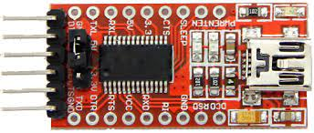

- **ESP-01M WiFi module**

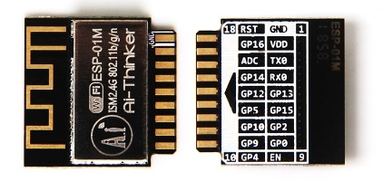

- **DC-DC Step-down converter from ~5V to 3.3V to power ESP-01M module**

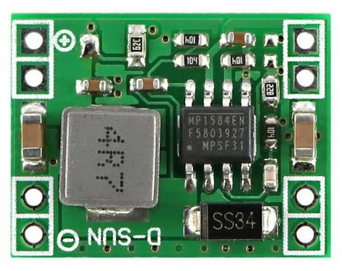

- **5V DC supply voltage. You can use some charger with at least 2A output current**

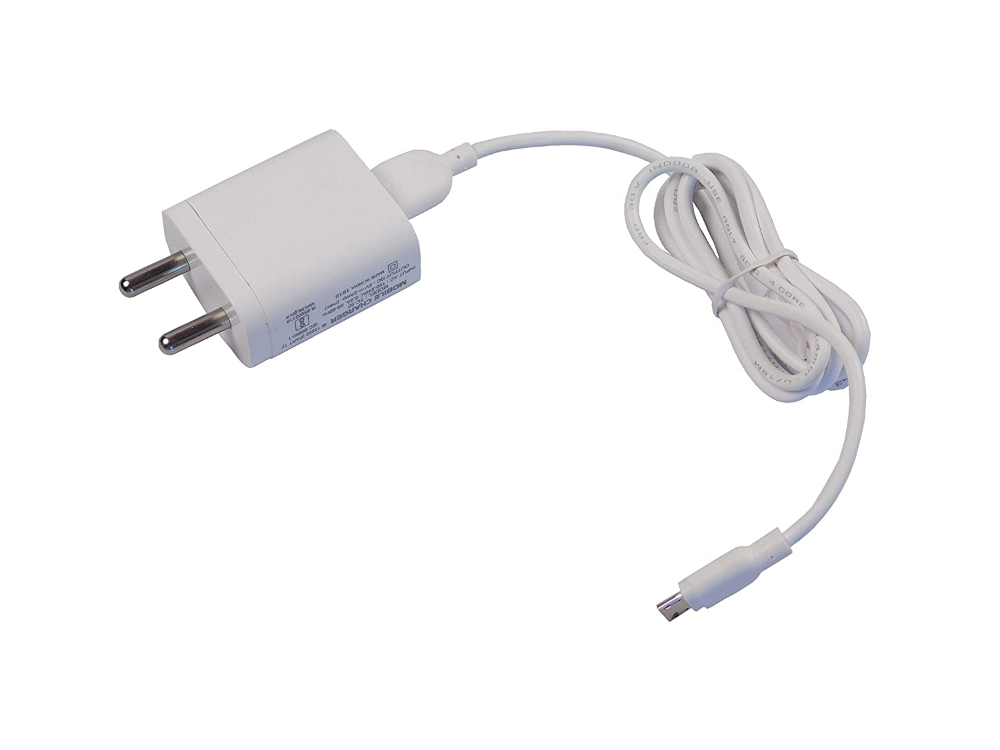

- **9 x NPN FET, you can use any which opens gate at low voltage. I've used [A2SHB](https://datasheetspdf.com/datasheet/A2SHB.html)**

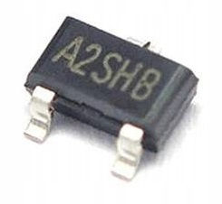

- **Long 5V RGB led strip (about 5M for 3 gates), depends how many gates do you want to create (max 3)**

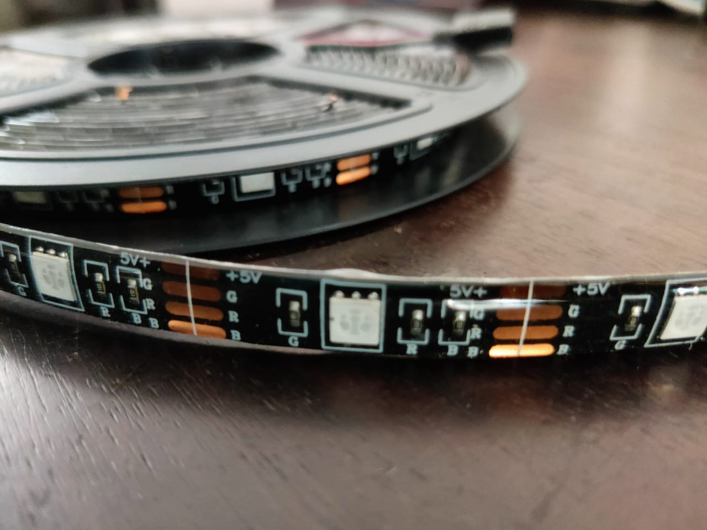

- **Cables (I've used 30AWG and 24AWG) to connect all components together**

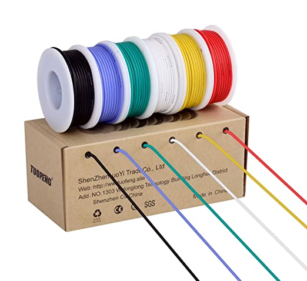

---

## Wiring

### IMPORTANT NOTE! <!-- omit in toc -->
### If you use adjustable step-down converter please measure output voltage before connect it to the ESP-01M module which accepts 3.3V. <!-- omit in toc -->

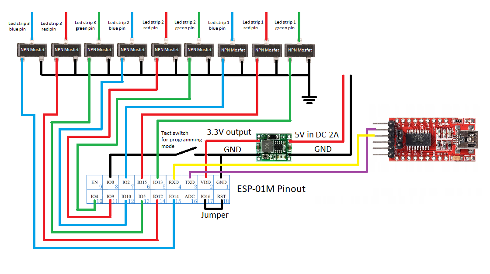

## My solution

As you can see below I covered ESP module and step-down converter with a heat shrinks. I used AWG cables for connections between mosfets pcbs and WiFi module. For connection between gates and mosfets old USB cable with 4 wires inside.
Gates can be done from PEX pipes for underfloor heating and led strips mounted on a zip ties.

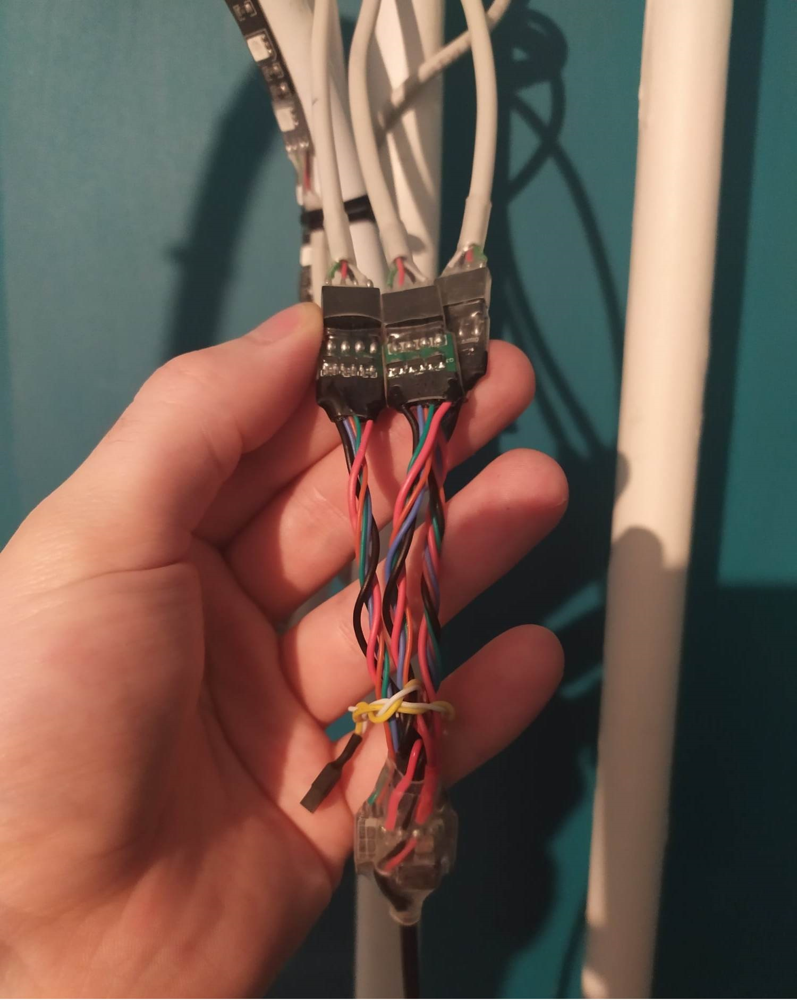
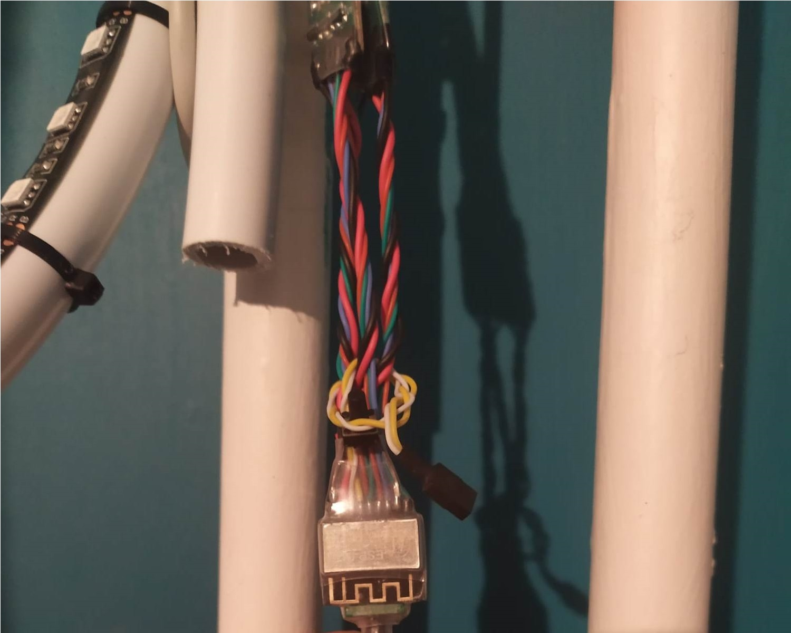

---

# Software

## How to upload the program?

1. Make sure that everything is connected as it has been described on wiring picture.
2. Install VS Code and PlatformIO plugin.
3. Press and hold tact switch connected between GPIO0 and GND.
4. Connect FTDI232 dongle programmer with all things to your computer.
5. Upload program and wait for success finish.
6. Unplug FTDI232 and connect it again with held tact switch mentioned in 2 point.
7. Upload Filesystem Image.

## How it works?

### IMPORTANT NOTE! <!-- omit in toc -->
### When device goes to AP config mode, please be sure that ip which you provide in wifi manager form is not used by some other device in your local network. <!-- omit in toc -->

## Web page
Web page consists of 3 color pickers with each light power intensity for every gate as well as button to disable or enable all led strips. 

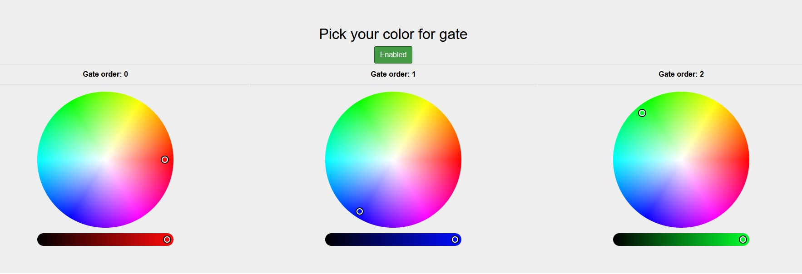

---  

# The final effects

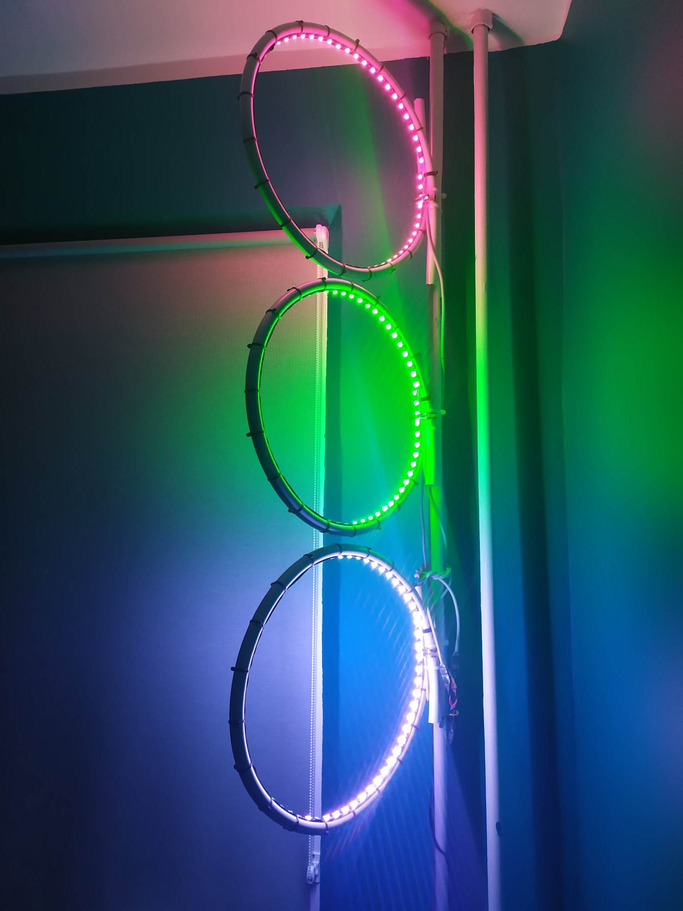
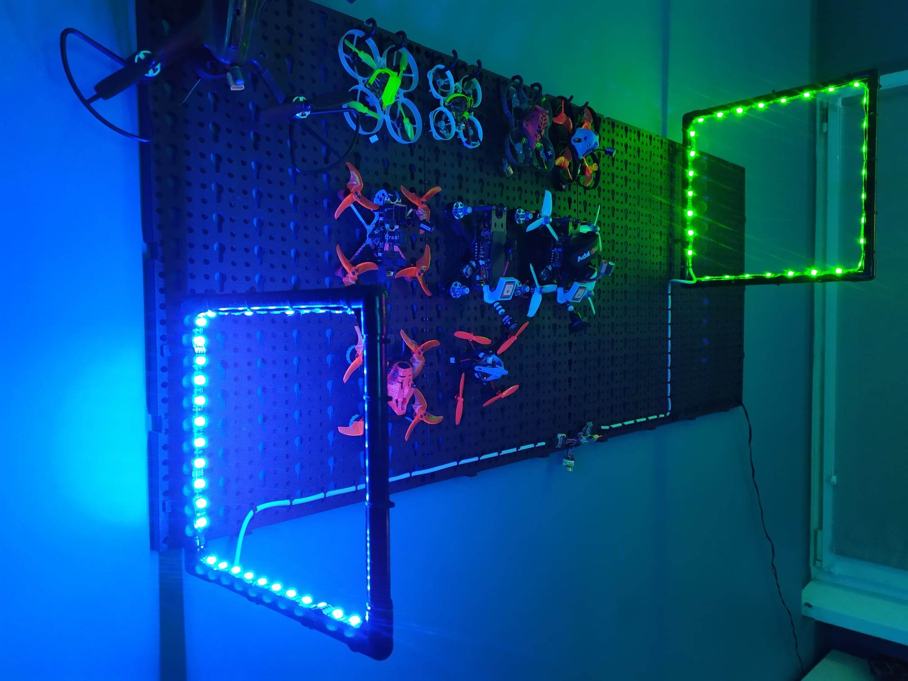
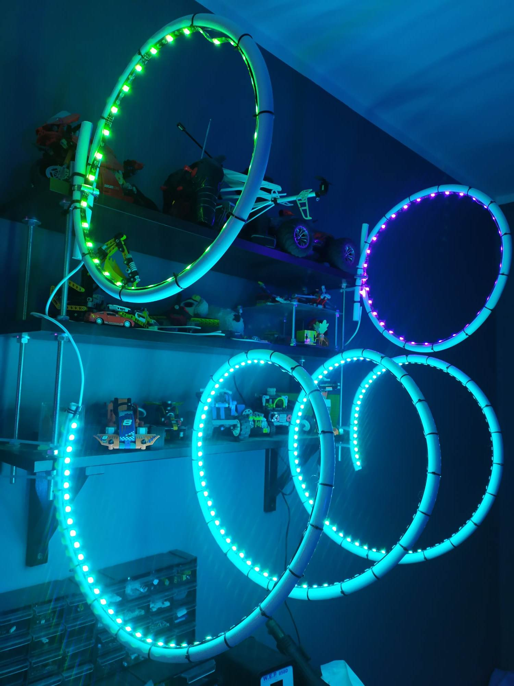

# TODO

* [ ] Settings feature to change gates number or order. 
* [ ] Settings feature to remove or change WiFi credentials during led server running
* [ ] Create junit tests finally :) 

# Limitations
- After connecting to WiFi network, device needs to be reseted due to async web servers overlaping
- From time to time software crashes and watchdog resets device - don't worry, it should connect to your WiFi and run led strips web server again - if not, just unplug and plug device to power again.

